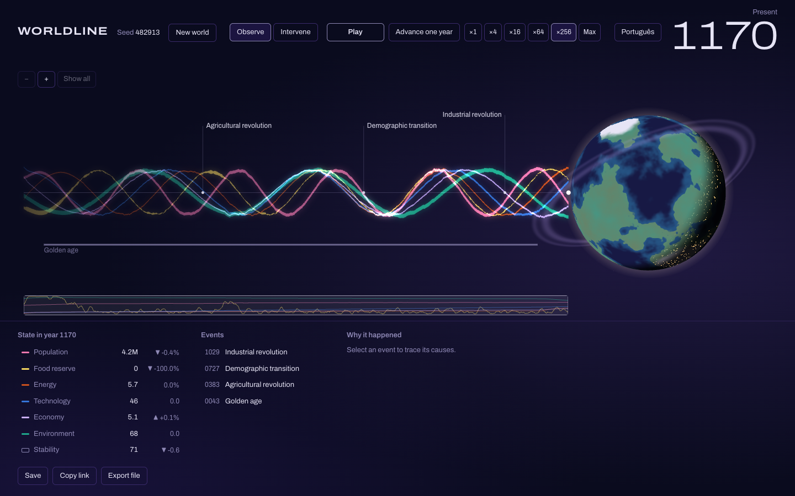
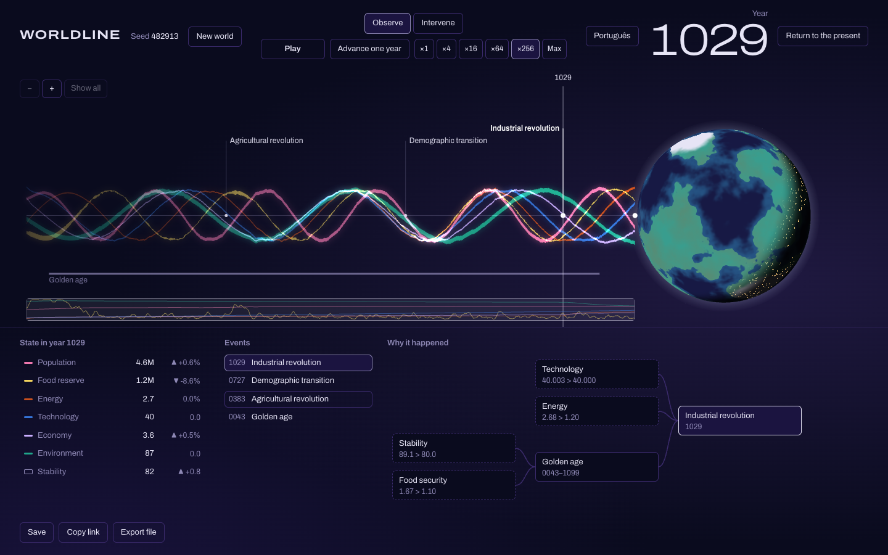
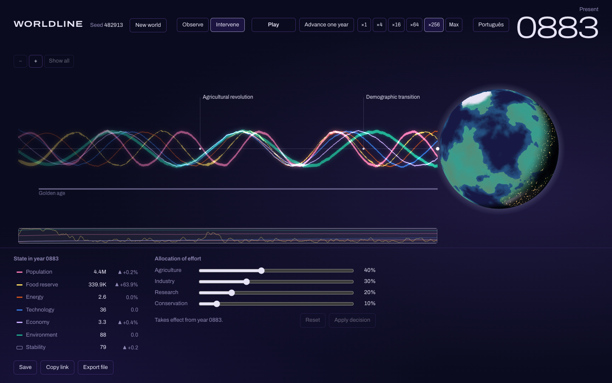
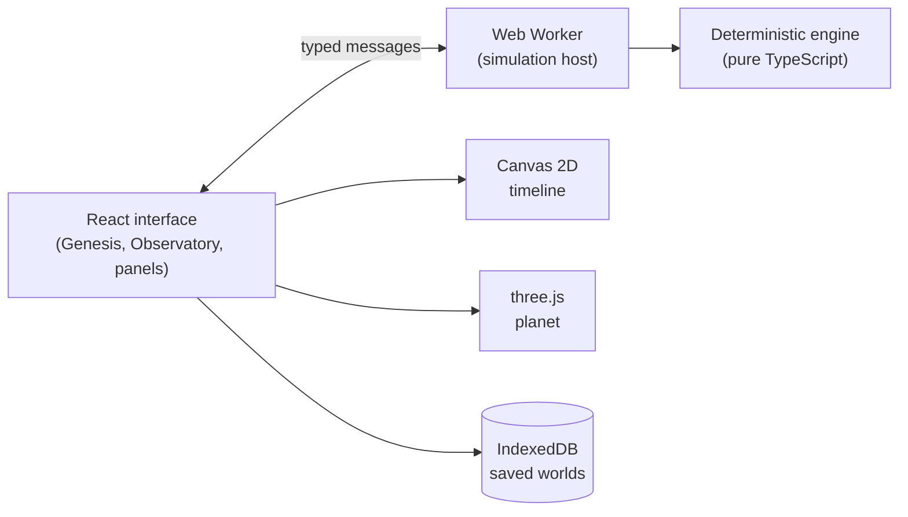

# WORLDLINE

[](https://github.com/LeonardoJCV/WorldLine/actions/workflows/ci.yml)

**Every decision creates a different future.**

WORLDLINE is an experimental civilization simulator. You create a world from a seed, let it run for thousands of years, and watch history emerge from a small set of causal rules: harvests and famines, industrial revolutions, ecological crises, golden ages. At any moment you can step in, change how the civilization allocates its effort, and see a different future unfold.



It is not a game with a win condition and it is not a dashboard. It is an instrument for exploring alternate histories.

## What you can do

- **Create a world** from a number or a word. The seed shapes the planet, its initial population, technology, environment and soil fertility.
- **Watch time pass** year by year, or at up to hundreds of years per second. Six variables braid along a luminous timeline and flow into a planet whose vegetation, city lights, atmosphere, orbital ring and satellites reflect the state of the world.
- **Observe any year** of the past by scrubbing the timeline; the planet and the state panel follow.
- **Ask why** something happened. Every event records its causes as a navigable causal chain: the conditions that held (with their real values), the earlier events that pushed them, and the decisions that preceded them.

  

- **Intervene** by reallocating effort between agriculture, industry, research and conservation. The decision takes effect from the present year and the world diverges from there.

  

- **Share and keep** worlds: the address bar always holds a link with the seed, the decisions and the year; worlds can be saved in the browser or exported as JSON files.

## Determinism

The same seed and the same decisions always produce the same history, in every browser. This is a design constraint, not an afterthought.

- **Engine-independent math.** JavaScript engines may disagree in the last bit of `Math.exp`, `Math.log` or `Math.pow`. The engine implements its own `exp`, `ln` and `pow` using only operations IEEE 754 guarantees to be correctly rounded (`+ − × ÷` and bit manipulation), and lint rules forbid the native versions inside the engine.
- **Counter-based randomness.** Every random draw is a pure hash of `(seed, year, channel)`. No draw can shift another, any year can be recomputed in isolation, and a branch that makes no new decision stays identical to its parent.
- **Fingerprints.** Each world state hashes to an 8-character fingerprint. Reference fingerprints for several seeds and decision scripts are pinned in the repository and checked by the test suite in Node, and by end-to-end tests in Chromium, Firefox and WebKit.
- **Check it yourself.** The `/verify` page re-runs the reference worlds in your browser and compares every fingerprint.

## How the simulation works

A world is six stocks (population, food reserve, energy, technology, economy and environment) plus a stability index with memory. Each year a fixed pipeline applies the current decision, derives quantities such as food security and pollution, updates every stock from the start-of-year state, and evaluates events. Causes always precede effects: an event triggered this year changes the world from next year on.

The rules are few and coupled, so behaviour comes from feedback loops rather than scripted outcomes:

```
food shortage → mortality ↑ → labour ↓ → production ↓ → food shortage worsens
technology ↑ → energy ↑ → industry ↑ → pollution ↑ → environment ↓ → harvests ↓
prosperity ↑ → births ↓ (demographic transition)
```

Events are declarative: triggers, release conditions (hysteresis), cooldowns, hazard probabilities that grow the further a threshold is crossed, and modifiers that last while the event is active. The model is calibrated against behavioural tests (a balanced world survives five millennia, heavy industry without conservation degrades its environment into crisis, neglecting agriculture brings famine within a century), and `npm run probe` prints a calibration report for five strategies.

## Architecture

Everything runs in the browser. There is no backend, no account and no external service.



- **`src/engine`**: pure TypeScript with no DOM access, checked by its own TypeScript configuration and lint rules: state, rules, events and causes, worldline history with checkpoints, replay and fork.
- **`src/worker`**: runs the engine off the main thread in time slices, streams progress once per frame and answers range and inspection requests.
- **`src/app`**: the interface: the Canvas timeline, the three.js planet (loaded on demand, with a 2D fallback), the state, events, causal-chain and allocation panels, English and Portuguese copy, links and persistence.
- **`src/verify`**: the reproducibility page.

## Tech stack

TypeScript, React, Vite, zustand, three.js, IndexedDB (`idb`), Vitest with fast-check for property-based tests, and Playwright for end-to-end tests.

## Running locally

Requires Node.js 22.18 or newer.

```bash
npm ci
npm run dev        # development server
npm test           # unit and property tests
npm run e2e        # end-to-end tests (after: npx playwright install)
npm run build      # production build in dist/
npm run probe      # calibration report
```

## Roadmap

This first version explores a single worldline. The engine already models lineage and forks; next come:

1. **Branching**: split a worldline at any year and compare the diverging futures.
2. **Crossline**: let information, resources or decisions cross from one worldline into another, under conditions set by the worlds themselves.
3. **Causal debt and paradoxes**: track what a world receives that its own history could not have produced.
4. **Merge and collapse**: reconcile two histories into a coherent new one, or watch an inconsistent one fall apart.

## License

[MIT](LICENSE)
